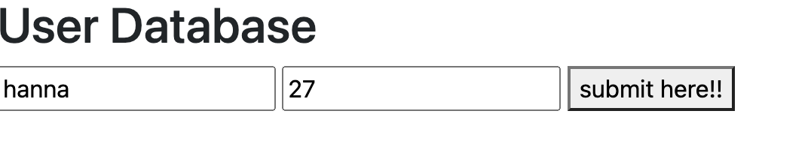

# Entry 2
##### 12/18/22
---
## Learn & Build
---

Winter Break:
* Try at least <b>1</b> ...
    * Authentication with emails
    * Connect with emails
    * Storage

It would be ideal to complete those all but I feel like at the moment there's so much work and it's harder to complete multiple tasks so I trying to take it to take it step by step.

Content:
I been tinkering my tool with real-time database. Remember to add my npm to link firebase, I did that. And with a short code below in my html to set up my webpage. 
```html
<h1> User Database </h1>

          <input type = "text" placeholders = "name" id = "namefield">
          <input type = "text" plaeholders = "age" id = "agefield">
          <button onclick = "datalist()"> submit here!! </button>
```



This was upsetting to me as it didn't work and I'm pretty sure I coded right, I kept looking back but I will just redo that someday. And recently I saw that if I want something to be updated I gotta type `npm run build` in my terminal or maybe that's only if I use a webpack.config and try up my index.js to a different file. Not so sure at the moment. <br>
Video used as guide was this [following link](https://www.youtube.com/watch?v=-UOkri_WNWQ&list=LL&index=71).

I realized that I have gotten discontinue from the last time I set up my work space and I did a seperate one in a seperate folder so I could get a clean surface. 
Also while, I was working I thought it would be fun to test out some extensions so coding would be neater with npm Intellisense and Liver Server. 

Anyways, side notes:
* When creating an app, go to its settings to grab the config object, basically the connecter between a html file and firebase --> paste in js file
* npm install firebase --> install the lastest version
* putting () in the end invokes a variable


Firestore Database: <br>
--> connect/initialize 
[8.11](https://www.youtube.com/watch?v=2yNyiW_41H8&list=PL4cUxeGkcC9jERUGvbudErNCeSZHWUVlb&index=4)


Engineering Design Process: 1

The problem is that I seem to always be short on cash and wondering why when I don't think I go out much or buy items. But then I realized I do and end up forgeting so I have no track of where my money has gone. I know a budget tracking is useful which I tried with paper but it's just not sustainable. However, a web app would solve this problem of mine, plus save me money from buying more supply to write with.

Skill:
The biggest skill, I will probably have to get used to also how to learn since changing. I have get used to firebase setup and familiarized myself with its concept. Another key skill eoulf be Attention to detail, spelling things correctl, and coping to syntax rules. The smallest details could be the last my 100 lines of syntax don't run, often times like a `;` or bracket.

[Previous](entry01.md) | [Next](entry03.md)

[Home](../README.md)