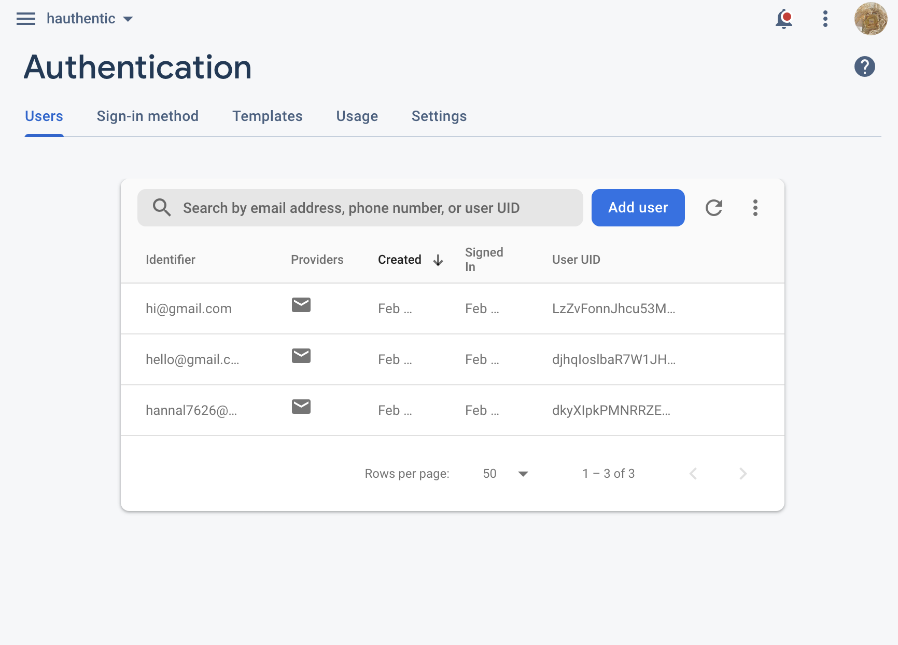

# Entry 3
##### 02/06/23
---
## Learn & Build 

Content:  
I tired practicing with realtime database again since that's what I need for my project. Along with [Write data in a firebase realtime database with javascript](https://www.youtube.com/watch?v=VXWmJsv1Vh4) as guidence. After adding the config and attaching firebase. 
I wanted to save names, so I made an `input` for the `namefield` and a `button` for submitting with the code below. 

Then I wrote js code to make my button interactive when it is clicked and push that information to my project's database.

This is the page with Yala being typed as the name:

And here is the result after clicking submit: 

Authentication:  
Following a [video](https://www.youtube.com/watch?v=fgdpvwEWJ9M), I set up the page to get start saving the email and password in firebase's authentication section. This is my page before typing anything in the text inputs:

Then to test the web, type in a test email and password for hello@gmail.com:

Open the console using inspect to check if the page is running correctly. 

Great! This shows that the data is being trnasfered to firebase's authenication and if I open the authenication page it should show the new information. 

Just like above.
From this exercise, I have a deeper understanding of how to initialize firebase, the most important is to always add the config in index.html and include which is being used. 

Engineering Design Process: 
This is process 2, research not the problem but the tool and getting used to its syntax. It is important to do so since creating the plan for this project will be soon. 

Skill:  
This is how to learn and debug. Problems came up while learning my tool and that was okay because I could debug it with the console's help. Also learn how to problem-solve instead of giving up. 

[Previous](entry02.md) | [Next](entry04.md)

[Home](../README.md)