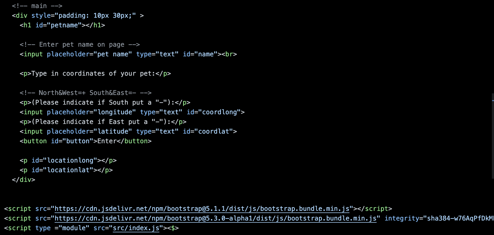
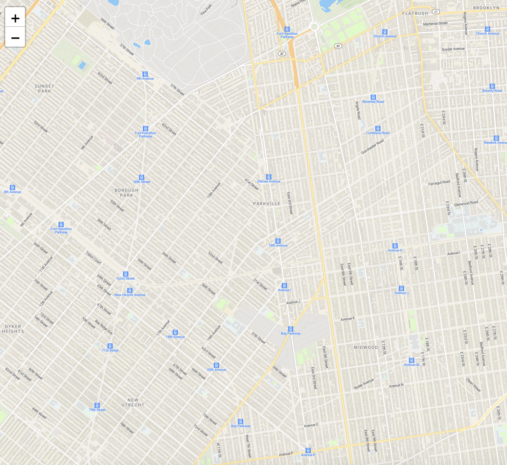

# Entry 4
##### 03/11/23

## MVP

Content: <br>
Mid-February, I switched my idea from my budgeting system to working with Yala and David on a pet finder app. We had discussed how we would split the work and included that in our MVP [file](https://docs.google.com/document/d/1IOgOBQIXL0xnpZYDINYj7pjE6Xca6grdK6rAzGLUkfc/edit?usp=sharing) and [wireframe](). In our own time, individually we practiced our tool and worked towards the steps indicated on our MVP sheet. 
Progress: 
I set up the `HTML` page for grabbing information so that Iand David can use firebase to store that data. While Yala adds a map to later locate the coordinates of the pet.

<br>
<!-- <br> -->
<br>
<br>
Below is the code used to store the pet information temporarily so we can later switch to firebase. 

``` js
// Set pet name
            document.getElementById('name').addEventListener("keyup",function(event){
                document.getElementById('petname').innerHTML = event.target.value;
            });

            //Set locations
            document.getElementById('button').addEventListener("click",function(event){
                document.getElementById('coordlong').addEventListener("change",function(event){
                    document.getElementById('locationlong').innerHTML = event.target.value;
                });
            });
            document.getElementById('button').addEventListener("click",function(event){
                document.getElementById('coordlat').addEventListener("change",function(event){
                    document.getElementById('locationlat').innerHTML = event.target.value;
                });
            });

```
As for firebase, I have gotten the initialization in and a ongoing problem occurred with the initialization of the realtime database. 

Using the [authentication docs](https://firebase.google.com/docs/auth/web/google-signin?hl=en&authuser=0) on firebase, I created a login page with so their pet data can be found using their email. Later on, me and David will storage its data with [firestore](https://firebase.google.com/docs/firestore?hl=en&authuser=0) so the user can easily access their information. 

But for now this is the start up.
<br>
```html 
<div>
    <div>
        <label>Email:</label>
        <input
            name="email"
            placeholder="Email"
            id="email"
            type="email" >
    </div>
    <div>
        <label>Password:</label>
        <input
        name="password"
        placeholder="Password"
        id="password"
        type="password"
        >
    </div>
    <button
    class="submit-btn"
    onclick="signup()"
    >Submit</button>
</div>
```

``` js 
            function signup(){
            const email = document.getElementById('email').value
            const password = document.getElementById('password').value
            const long = localStorage.getItem('long-trans')
            const lat = localStorage.getItem('lat-trans')
            console.log(email, password)

auth.createUserWithEmailAndPassword(email, password)
            .then((result) => {
                // This gives you a Google Access Token. You can use it to access the Google API.
                const credential = GoogleAuthProvider.credentialFromResult(result);
                const token = credential.accessToken;
                // The signed-in user info.
                const user = result.user;
                // IdP data available using getAdditionalUserInfo(result)
                // ...
            })
                 .catch((err) => {
                console.log(err.code)
                console.log(err.message)
                alert("Please write a valid email/valid password");//future: make this into a popup
                // The email of the user's account used.
                const email = err.customData.email;
                // The AuthCredential type that was used.
            })
        }
```

As of now, the code doesn't actually do much because this is only the set to make sure the user is typing a valid email and password. `createUserWithEmailAndPassword` is a property from firebase and it does exactly as it sounds. `.catch(err)` is used to make sure the email and password is written properly otherwise, the alert-- "Please write a valid email/valid password" appears to the user and in the console it will show me 

Until, a valid email and password is pressed then the account will be saved in aunthenication of firebase.

Engineering Design Process:<br>
This is the EDP of creation. We have planned and started building the MVP page of our prototype. Also, the part to test and debug. 

Skill: <br>
This is how to learn and debug. Problems came up while learning my tool and that was okay because I could debug it with the console's help. This also taught me patience, it is important to take my time with each line of code and not rush through. Working in a group meant that communication is a norm, it is important to let my partners know when I am having trouble in case of code overlaps and errors and to prevent misconnection. 

[Previous](entry03.md) | [Next](entry05.md)

[Home](../README.md)
